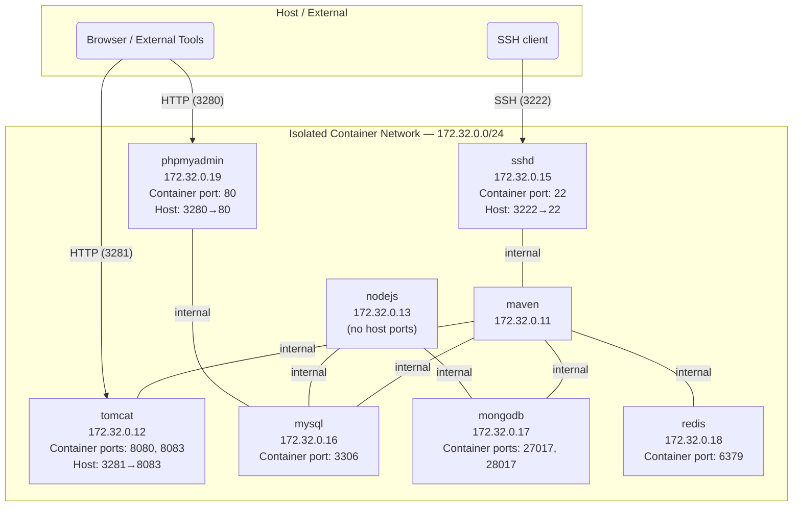
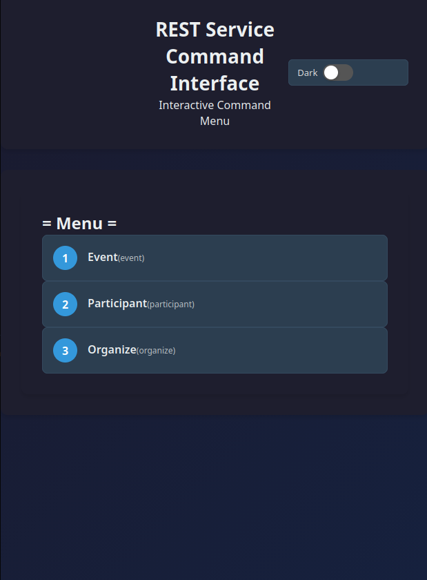
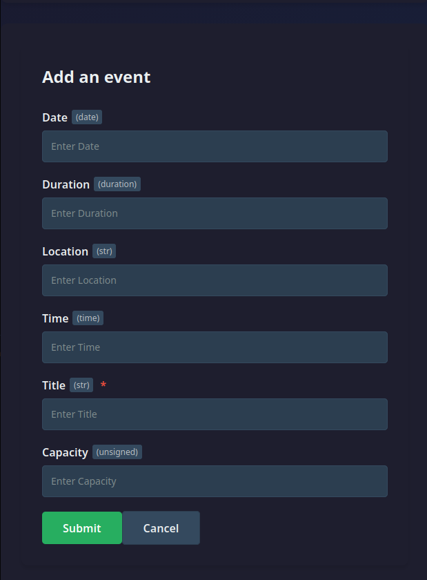
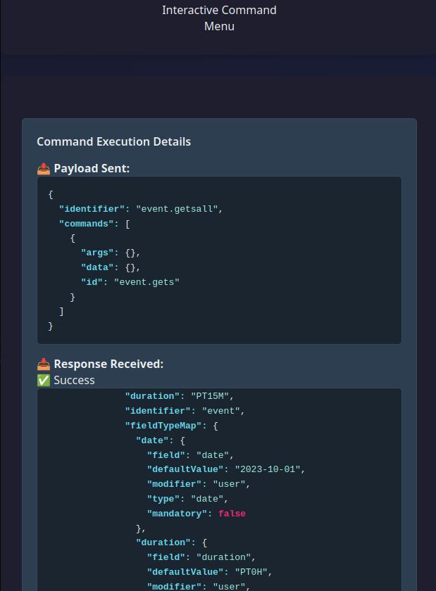
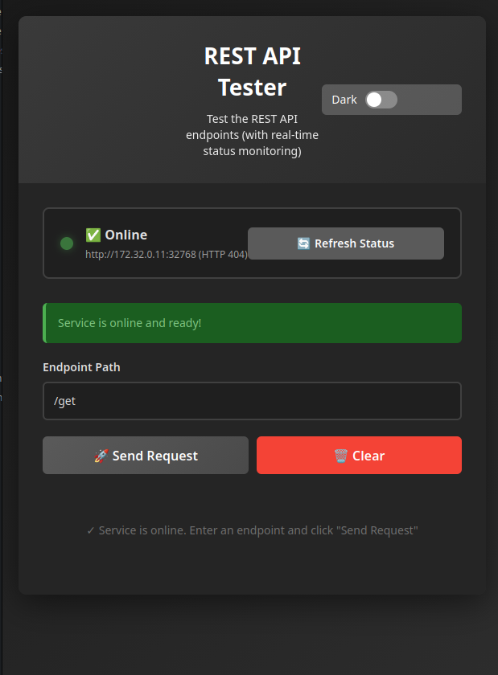
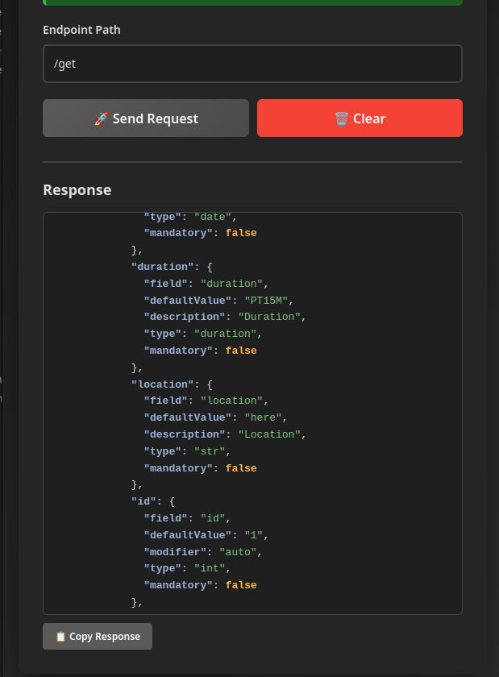
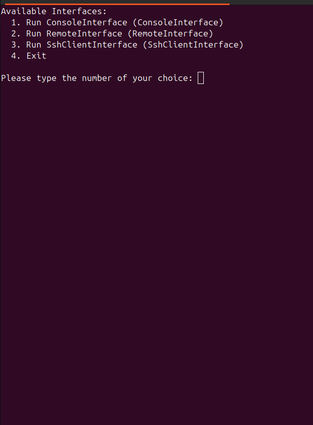
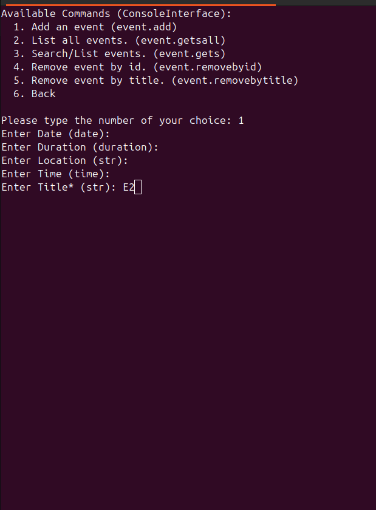
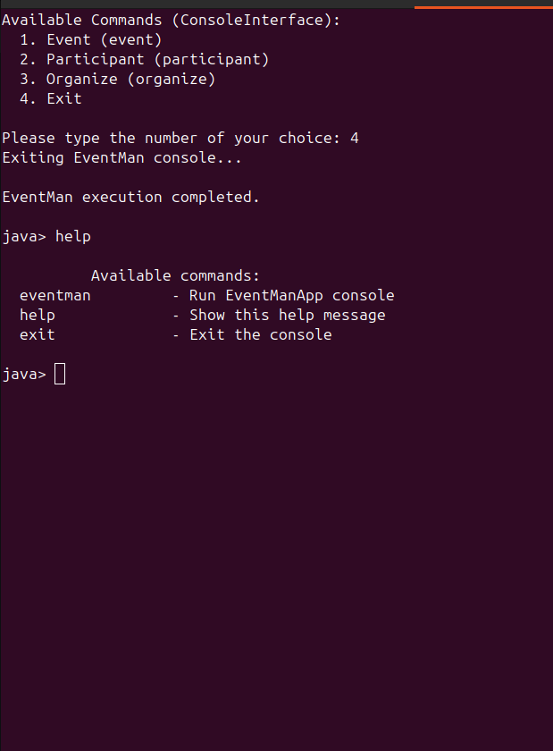
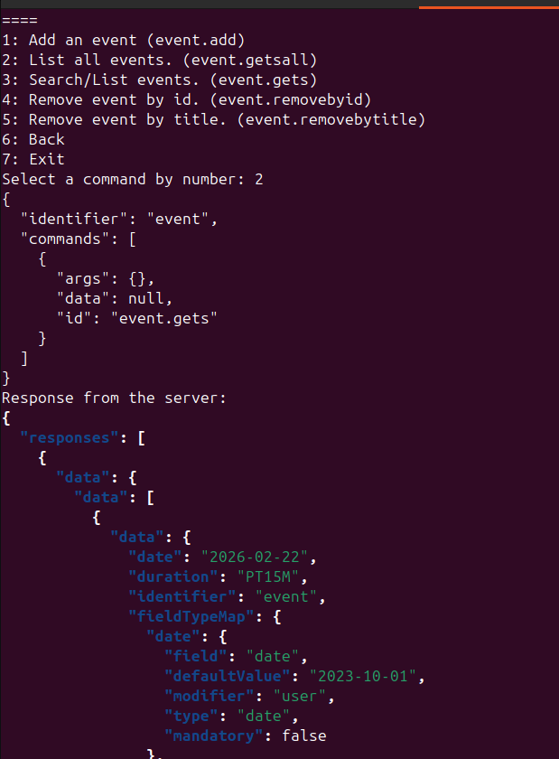

# GenStack
[**Deck Board**](https://github.com/hoss-java/GenStack/blob/main/DECK.md)

## An introduction and overview

### Sandbox (Containerized CI environment)

### Findigs summary

#### The repo topology

#### The Current design

#### Supported commands structures

## how it works

## ScreenShots

